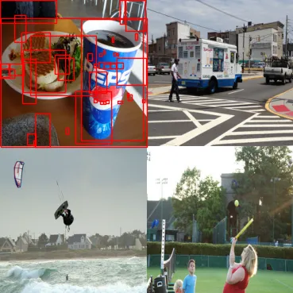
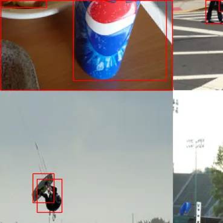

# VisDrone2019 Dataset Understanding and Preprocessing

## Task Overview

This task focuses on understanding and preparing the **VisDrone2019-DET** dataset for object detection using YOLO. The goal of this stage is to inspect the dataset structure, verify the available train/validation/test images, understand the annotation situation, document the preprocessing decisions, and visualize the augmentation strategy used during model training.

The dataset was configured using a `dataset.yaml` file that directly points to the existing VisDrone2019 folders. No additional manual train/validation/test split was performed.

---

## 1. Dataset Configuration

The dataset was configured as follows:

```yaml
# Dataset paths
path: /kaggle/input/datasets/fateennr/visdrone-dataset/visDrone/VisDrone_Dataset
train: /kaggle/input/datasets/fateennr/visdrone-dataset/visDrone/VisDrone_Dataset/VisDrone2019-DET-train/images
val: /kaggle/input/datasets/fateennr/visdrone-dataset/visDrone/VisDrone_Dataset/VisDrone2019-DET-val/images
test: /kaggle/input/datasets/fateennr/visdrone-dataset/visDrone/VisDrone_Dataset/VisDrone2019-DET-test-dev/images

# Number of classes
nc: 2

# Class names
names: ['person', 'car']
```

The final model was trained only for two classes:

| Class ID | Class Name |
|---:|---|
| 0 | person |
| 1 | car |

During cleanup, the original VisDrone human-related categories were merged:

```text
pedestrian + people/person → person
car                        → car
all other classes           → removed
```

This simplifies the original VisDrone multi-class detection problem into a two-class object detection task focused on humans and cars.

---

## 2. Dataset Size

The dataset folders were inspected directly from the YAML paths. The result was:

| Split | Image Directory Exists | Label Directory Exists | Images | Labels | Images Without Labels | Labels Without Images |
|---|---|---|---:|---:|---:|---:|
| train | True | False | 6471 | 0 | 6471 | 0 |
| val | True | False | 548 | 0 | 548 | 0 |
| test | True | False | 1610 | 0 | 1610 | 0 |

### Interpretation

The image folders exist correctly for all three splits:

- `VisDrone2019-DET-train/images`
- `VisDrone2019-DET-val/images`
- `VisDrone2019-DET-test-dev/images`

However, the checked label directory was not found at the expected location. As a result, the count shows:

```text
labels = 0
images_without_labels = total number of images
```

This does **not** mean the dataset has no annotations. It means that the script did not find labels in the expected directory path. In the original VisDrone format, annotations are usually stored in an `annotations/` folder, while YOLO training expects labels in a `labels/` folder using normalized YOLO format.

Therefore, for YOLO training, the annotation files must either already be converted into YOLO format or generated before training.

Expected YOLO-style structure:

```text
VisDrone_Dataset/
├── VisDrone2019-DET-train/
│   ├── images/
│   └── labels/
├── VisDrone2019-DET-val/
│   ├── images/
│   └── labels/
└── VisDrone2019-DET-test-dev/
    ├── images/
    └── labels/
```

---

## 3. Preprocessing Steps

The preprocessing stage involved converting the dataset into a format suitable for YOLO training.

### 3.1 Class Mapping

The original VisDrone dataset contains multiple object categories such as pedestrian, people, bicycle, car, van, truck, tricycle, awning-tricycle, bus, and motor. For this project, only two target classes were kept.

The mapping used was:

| Original Category | Final Category |
|---|---|
| pedestrian | person |
| people/person | person |
| car | car |
| other classes | removed |

This mapping helps reduce class complexity and focuses the model on the two most important classes for this experiment.

### 3.2 Annotation Conversion

Original VisDrone annotations are commonly stored in this format:

```text
bbox_left, bbox_top, bbox_width, bbox_height, score, object_category, truncation, occlusion
```

YOLO requires labels in this format:

```text
class_id x_center y_center width height
```

All coordinates must be normalized between `0` and `1` relative to image width and height.

The conversion formula is:

```text
x_center = (bbox_left + bbox_width / 2) / image_width
y_center = (bbox_top + bbox_height / 2) / image_height
width    = bbox_width / image_width
height   = bbox_height / image_height
```

Invalid boxes, ignored regions, and removed classes were filtered out during cleanup.

---

## 4. Mosaic Augmentation Visualization

Two mosaic visualization examples were generated to show how mosaic augmentation affects the training images.

### Example 1: Mosaic Image With Bounding Boxes

The first mosaic visualization combines four different images into one training sample. Red bounding boxes are drawn over the visible target objects.



This example shows how mosaic augmentation increases scene diversity within a single image. It exposes the model to objects from different backgrounds, scales, and camera viewpoints at the same time.

In the shown mosaic:

- The image is formed from four separate scenes.
- Objects from each image are preserved with adjusted bounding boxes.
- The model sees multiple environments in one training sample.
- Small objects become more frequent in a single training image.

For VisDrone-style detection, this is useful because drone images often contain small and dense objects. Mosaic augmentation can help the model generalize better to different object scales and scene layouts.

---

### Example 2: Completed Mosaic / Cropped Mosaic Region

The second visualization shows the completed mosaic after resizing/cropping operations.



This image demonstrates an important side effect of mosaic augmentation: some objects may become partially cropped or appear smaller after the final image is resized. This can make training more challenging, but it also teaches the model to handle partial visibility and scale changes.

In the shown example:

- Some objects are enlarged or cropped due to mosaic placement.
- One person object appears in a small region of the image.
- Bounding boxes remain adjusted to the transformed image.
- The final training sample contains strong scale variation.

This is useful for drone-based detection because real VisDrone images often contain partially visible objects, small persons, and distant vehicles.

---

## 5. Augmentation Strategy

During YOLO training, mosaic and standard augmentations were enabled as training parameters.

Common augmentations used in YOLO-style training include:

| Augmentation | Purpose |
|---|---|
| Mosaic | Combines multiple images into one sample and improves scale/background diversity |
| Resize to 960px | Preserves more small-object detail than lower resolutions |
| Horizontal flip | Improves robustness to object direction changes |
| Scale augmentation | Simulates different drone altitudes |
| Translation | Improves robustness to object position changes |
| HSV/color augmentation | Handles lighting and color variation |
| Blur/noise augmentation | Helps with motion blur and low-quality frames |

For this project, training with image size **960px** was selected to improve the visibility of small objects. This is especially important for detecting persons, because people in drone images are often very small.

---

## 6. Dataset Challenges

The VisDrone2019 dataset is difficult because it is collected from aerial drone viewpoints. These viewpoints create several problems that directly affect detection performance.

### 6.1 Small Object Problem

The most important challenge is the small-object problem. Since images are captured from drones, people and cars may occupy only a small number of pixels. This is especially severe for the `person` class.

Small objects are difficult because:

- They contain limited visual information.
- Features can disappear after CNN downsampling.
- Their bounding boxes are harder to localize precisely.
- They are easily confused with background texture.
- Low-resolution training can make them nearly invisible.

This is why the model was trained at **960px** instead of a smaller size such as 640px. A larger input size helps preserve more details for tiny objects.

### 6.2 Dense Scenes

VisDrone images often contain busy roads, traffic areas, parking spaces, and crowded pedestrian zones. Many objects appear close together or overlap with each other.

This creates problems such as:

- Missed detections in crowded regions.
- Duplicate boxes around the same object.
- Difficult non-maximum suppression.
- Confusion between nearby persons or vehicles.

Dense scenes are especially difficult for small persons because multiple people may appear as tiny nearby blobs.

### 6.3 Occlusion

Objects in VisDrone are frequently occluded by:

- Other vehicles
- Other pedestrians
- Trees
- Buildings
- Roadside structures
- Image boundaries

Occlusion reduces the visible area of an object, making classification and localization harder. Partial persons are particularly difficult because only a small part of the body may be visible.

### 6.4 Scale Variation

Drone altitude and camera angle change from image to image. As a result, the same class can appear at very different sizes.

For example:

- A nearby car may be large and clear.
- A distant car may be tiny.
- A person close to the camera may be visible.
- A person far away may occupy only a few pixels.

This scale variation makes it harder for the model to learn consistent object features.

### 6.5 Complex Backgrounds

Drone images contain complex backgrounds such as roads, rooftops, lane markings, trees, shadows, buildings, and parked objects. These backgrounds can look similar to small object patterns.

This can lead to:

- False positives where background regions are predicted as objects.
- False negatives where small objects blend into the background.
- Lower confidence for heavily occluded or low-contrast targets.

### 6.6 Class Cleanup Issues

Because the dataset was cleaned to keep only `person` and `car`, several preprocessing issues must be handled carefully:

- Removed classes should not remain in YOLO label files.
- Empty label files may appear after filtering unused classes.
- Pedestrian and people/person must be mapped consistently to `person`.
- Original VisDrone annotation IDs must be converted correctly.
- Label paths must match the image paths used in `dataset.yaml`.

The dataset inspection table showed that the expected label directory was not found, so the label path should be verified before training or evaluation.

---

## 7. Why Mosaic and 960px Training Help

The combination of **mosaic augmentation** and **960px input size** is suitable for VisDrone because the dataset contains many small and dense objects.

### Benefits of 960px Image Size

- Preserves more object detail.
- Improves small person visibility.
- Helps bounding box localization.
- Reduces the chance that tiny objects disappear after resizing.

### Benefits of Mosaic Augmentation

- Increases object diversity per batch.
- Shows the model more backgrounds in one image.
- Improves robustness to scale changes.
- Helps the model learn from dense object layouts.
- Simulates partial/cropped objects.

### Risk of Mosaic

Mosaic can also make small objects even smaller. For VisDrone, this can be risky for the `person` class. A good practice is to reduce or disable mosaic near the end of training so the model can fine-tune on normal image layouts.

For YOLO training, this is often done with:

```text
close_mosaic = 10
```

This disables mosaic during the last training epochs.

---

## 8. Summary

This task inspected the VisDrone2019 dataset configuration and documented the preprocessing and augmentation strategy used for YOLO training. The dataset was not manually split because the YAML file already points to the official train, validation, and test-dev image folders.

The dataset contains:

| Split | Images |
|---|---:|
| train | 6471 |
| val | 548 |
| test-dev | 1610 |

The project uses only two final classes:

```text
person
car
```

The `person` class was created by merging pedestrian and people/person categories, while all other classes were removed. Mosaic augmentation and standard YOLO augmentations were applied during training, with an image size of 960px.

The main dataset challenges are small objects, dense scenes, occlusion, scale variation, complex backgrounds, and careful class-remapping requirements. Among these, the small-object problem is the most important because persons in drone images often occupy very few pixels. The use of 960px training and mosaic augmentation is appropriate for improving model robustness, but label path verification and small-object performance should remain key evaluation priorities.


# Task-02: Model Training and Evaluation Summary

## Training Overview

A YOLO-based object detection model was trained on the cleaned VisDrone2019 dataset. The original dataset classes were simplified into two target classes:

```text
0 = person
1 = car
```

The `person` class was created by merging the original pedestrian and people/person categories. The `car` class was kept unchanged, and all other classes were removed. This preprocessing step simplified the detection task and allowed the model to focus on person and car detection in aerial drone images.

The model was trained using an input image size of **960×960** to preserve more details of small objects. Mosaic augmentation and other YOLO augmentations were enabled during training to improve robustness against scale variation, dense scenes, and different drone viewpoints.

---

## Training Configuration

| Parameter | Value |
|---|---:|
| Model | YOLO26n |
| Dataset | Cleaned VisDrone2019 |
| Number of classes | 2 |
| Classes | person, car |
| Image size | 960 |
| Epochs | 50 |
| Batch size | 8 |
| Pretrained weights | Yes |
| Mosaic augmentation | Enabled |
| Close mosaic | Last 10 epochs |
| Standard YOLO augmentations | Enabled |

Mosaic augmentation was used to expose the model to different object scales and scene layouts. It was disabled during the final 10 epochs using `close_mosaic=10`, allowing the model to fine-tune on normal image layouts.

---

## Final Results

| Metric | Value |
|---|---:|
| Best mAP50-95 | 0.38268 |
| Best mAP50 | 0.67870 |
| Final Precision | 0.74938 |
| Final Recall | 0.61829 |
| Final mAP50 | 0.67857 |
| Final mAP50-95 | 0.38162 |

The model achieved a final **mAP50 of 0.67857**, showing that it can detect many objects correctly at a standard IoU threshold. However, the lower **mAP50-95 of 0.38162** shows that precise bounding-box localization remains challenging.

The final precision of **0.74938** means that most predicted detections are correct. The recall of **0.61829** shows that the model still misses some ground-truth objects, especially small and occluded objects.

---

## Training Loss Analysis

The training and validation losses decreased during training, showing that the model learned useful features from the dataset.

| Loss Type | Initial Value | Final Value | Observation |
|---|---:|---:|---|
| Train box loss | 2.04769 | 1.68198 | Decreased steadily |
| Train class loss | 2.36024 | 0.97942 | Strong improvement |
| Validation box loss | 1.91799 | 1.75824 | Slight improvement |
| Validation class loss | 1.49912 | 1.04248 | Improved clearly |

The classification loss improved strongly, meaning the model became better at distinguishing between `person` and `car`. The box loss improved more slowly, which indicates that accurate localization is still difficult, mainly because VisDrone contains many small and dense objects.

---

## Precision and Recall Interpretation

```text
Precision = 0.74938
Recall    = 0.61829
```

The model is better at making correct predictions than detecting every object. This means false positives are relatively controlled, but missed detections are still an issue.

This is expected for VisDrone2019 because many objects, especially persons, are very small in drone images. Small objects contain limited visual information, making them harder to detect.

---

## mAP50 and mAP50-95 Interpretation

```text
mAP50    = 0.67857
mAP50-95 = 0.38162
```

The difference between mAP50 and mAP50-95 shows that the model can often detect the correct object region, but the predicted bounding boxes are not always tightly aligned with the ground-truth boxes.

This localization issue is mainly caused by small objects, occlusion, dense scenes, and scale variation in aerial images.

---

## Class-wise Performance

| Class | AP@0.5 |
|---|---:|
| person | approximately 0.555 |
| car | approximately 0.801 |
| overall | approximately 0.678 |

The model performed better on the `car` class than on the `person` class. Cars are usually larger, more rigid, and easier to recognize from aerial viewpoints. Persons are much smaller, less visually consistent, and more affected by occlusion, crowding, and background noise.

---

## Confusion Matrix Summary

The confusion matrix showed that the model can distinguish between `person` and `car` reasonably well. The main problem was not heavy confusion between the two classes. Instead, many real objects were missed and classified as background.

This problem was stronger for the `person` class because persons are smaller and more frequently occluded in drone images.

---

## Visual Result Summary

The validation prediction images showed that the model successfully detected many persons and cars. Car detections were generally more stable and accurate. Person detections were more difficult, especially in crowded or occluded areas.

Some small persons were missed, and some bounding boxes were not tightly aligned. These visual results match the numerical metrics, where precision is higher than recall and mAP50 is much higher than mAP50-95.

---

## Dataset Challenges Observed During Training

### Small Object Detection

Small-object detection was the main challenge. Since VisDrone images are captured from drones, many persons and distant cars occupy only a small number of pixels. This makes feature extraction and localization difficult.

### Dense Scenes

Many images contain roads, intersections, parking areas, and pedestrian zones with many objects close together. This can cause missed detections, overlapping boxes, or duplicate detections.

### Occlusion

Objects are often partially blocked by vehicles, trees, buildings, shadows, or other objects. Occlusion reduces the visible information available to the model.

### Scale Variation

The same object class can appear at very different sizes depending on drone altitude and camera angle. This makes detection harder because the model must handle both large nearby objects and tiny distant objects.

### Localization Difficulty

The gap between mAP50 and mAP50-95 shows that precise bounding-box localization is still difficult. The model often finds the object area, but the box is not always accurate enough under stricter IoU thresholds.

---

## Effect of 960px Image Size and Mosaic Augmentation

Using **960×960** image size helped preserve more small-object details compared with lower resolutions. This was useful for VisDrone2019 because persons and distant vehicles are often tiny.

Mosaic augmentation helped the model learn from more varied object scales, backgrounds, and layouts. However, mosaic can also make small objects even smaller, so disabling it in the final epochs with `close_mosaic=10` helped the model fine-tune on normal images.

---

## Final Summary

The YOLO26n model trained on the cleaned VisDrone2019 dataset achieved a final precision of **0.74938**, recall of **0.61829**, mAP50 of **0.67857**, and mAP50-95 of **0.38162**.

The training was successful, and the model learned meaningful features for detecting persons and cars. The model performed better on cars than persons because cars are larger and more visually consistent. The person class remained more difficult due to small object size, occlusion, crowding, and complex aerial backgrounds.

Overall, the use of **960px input size**, **mosaic augmentation**, and standard YOLO augmentations was suitable for this dataset. The main remaining limitation is detecting and accurately localizing small or occluded persons.

---

## Possible Improvements

Possible future improvements include:

- Training for more epochs with careful monitoring.
- Tuning confidence and IoU thresholds during inference.
- Improving person recall with small-object-focused strategies.
- Testing higher image sizes if GPU memory allows.

The most important improvement would likely come from using tiled inference or a larger model, because the current model mainly struggles with very small objects in aerial scenes.

